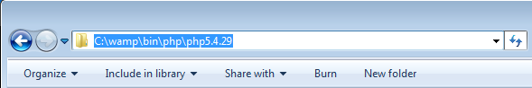

## How to Upgrade PHP in WAMP

One of the great things about WAMP is that it allows you to easily switch between different versions of PHP. All you need to do is properly install the different versions of PHP for your machine. Here is how it’s done.

## Installation

Download the zip file for the version of PHP for Windows that you wish to install.

1. https://windows.php.net/download/
# Make sure that you download the correct Thread Safe version 
Create a new folder in [path-to-wamp]/bin/php/php.#.#.# where [path-to-wamp] is the location that WAMP is installed on your machine and #.#.# corresponds to the version that you are installing,

  

2. Extract the all files from your download to the new PHP directory you created in the previous step. That list of files should look similar to the ones captured in the screenshot below :

(images/update-php-files)

3. Copy the following files from your old PHP directory to your new PHP directory:

php.ini
phpForApache.ini
wampserver.conf
These files contain your PHP, Apache and WAMP configurations.

(images/update-php-wamp-server-config)

4. Open the php.ini and phpForApache.ini files in your new PHP directory that you copied in the previous step. Search for any references to your old PHP version and replace them with the new PHP version. You will for sure need to update the extension_dir path. Depending on what PHP extensions you have installed, you may need to update others as well.

Start WAMP (if it’s not already started) and take note of all the active PHP settings and extensions that you are currently running. You will need this information in a future step.:

(images/update-php-settings-in-wamp.png)

(images/update-php-extensions-in-wamp)

6. Open your php.ini file in WAMP and create a backup of this file:

(images/update-php-wamp-php-ini.png)

7. Exit WAMP entirely and restart it:

(images/update-php-exit-wamp.png)

Once WAMP has restarted, select the option to Stop All Services:
(images/update-php-wamp-stop-all-services.png)

With all services stopped, select the version of PHP that you wish to run from the PHP Version menu in WAMP:

(images/update-php-wamp-php-version-menu.png)

Lastly, Restart All Services in WAMP for your new PHP configuration to take effect. …And give yourself a pat on the back, PHP in WAMP has been successfully upgraded!:

(images/update-php-wamp-restart-all-services.png)

